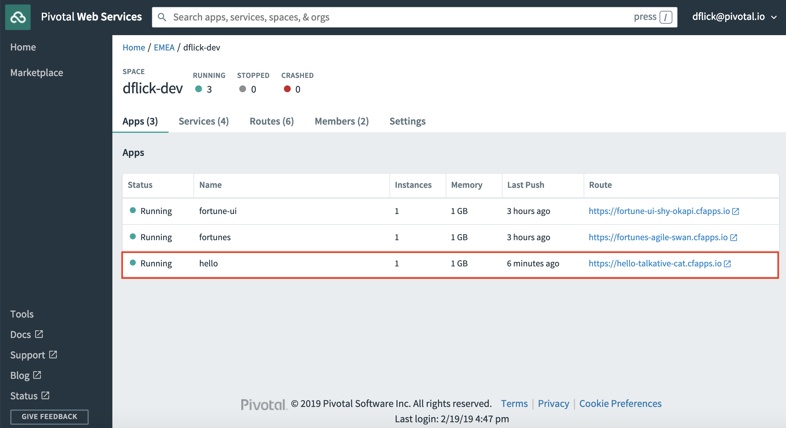
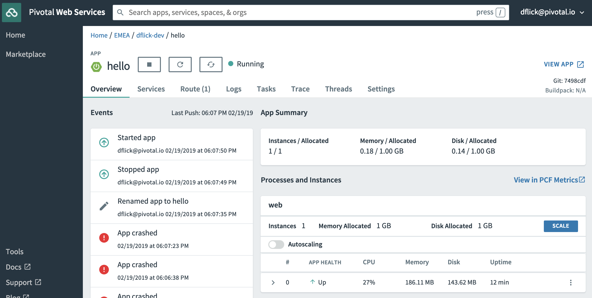
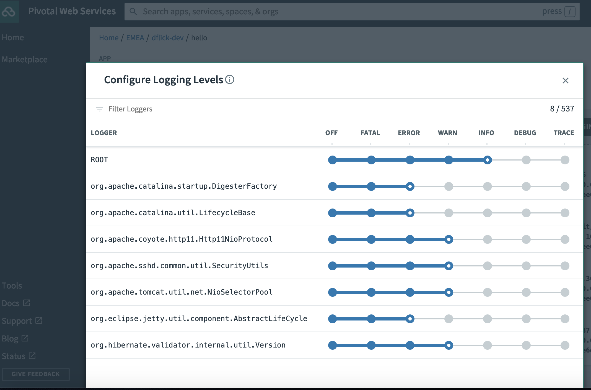
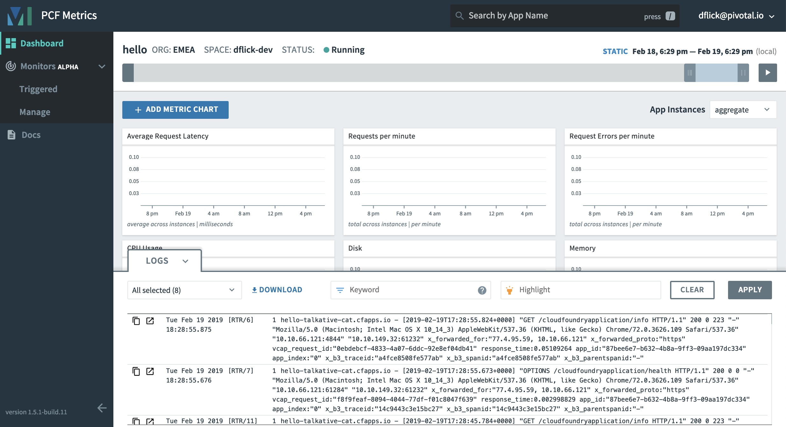

= Lab 3 - Operate the App on Cloud Foundry

_A completed version of this lab is found at `$COURSE_HOME/labs/complete/hello-spring-boot`._

== Create a manifest file

. Continue with the project you completed in link:lab_02.html[Lab 2].

. Create a `manifest.yml` file in the project root folder. Manifests provide consistency and reproducibility deploying apps to Cloud Foundry:

+
----
--- <1>
applications: <2>
- name: hello <3>
  random-route: true <4>
  memory: 1G <5>
  instances: 1
	path: target/hello-spring-boot-0.0.1-SNAPSHOT.jar <6>
----
+
<1> The manifest begins with three dashes.
<2> The applications block begins with a heading followed by a colon.
<3> The app name.
<4> A route mapped to an app is required to be unique on a Cloud Foundry instance. The property ensures a unique route mapped to the app.
<5> There are plenty other properties available (ex. memory of the container the app lives in). https://docs.pivotal.io/pivotalcf/2-4/devguide/deploy-apps/manifest.html[docs]
<6> Path to the artifact we want to run on Cloud Foundry

== Push!

. Login to Pivotal Cloud Foundry using the Cloud Foundry CLI, and target the space you were assigned in the class spreadsheet:
+
----
cf login -a api.run.pivotal.io
API endpoint: api.run.pivotal.io

Email> dflick@pivotal.io

Password>
Authenticating...
OK

Select an org (or press enter to skip):
1. dieter-org
2. EMEA

Org> 2
Targeted org EMEA

Select a space (or press enter to skip):
There are too many options to display, please type in the name.

Space> dflick-dev
Targeted space dflick-dev

API endpoint:   https://api.run.pivotal.io (API version: 2.131.0)
User:           dflick@pivotal.io
Org:            EMEA
Space:          dflick-dev
----

. Push the app to cloud foundry:
+
----
cf push
----

== Apps Manager

. Access http://console.run.pivotal.io in the browser. You'll be redirected to login.

. Choose your organization and space and you should see your app:
+

. Click on the route to load the app in a browser:
+
image::Common/images/app_02.png[]

. Go back to the apps manager and click on the app name to see more details:
+

. Recognize the spring-boot icon in the left hand upper corner. This indicates the app was recognized as a spring-boot app. This allows you to access within apps manager ui actuator endpoints to operate your app. Click on Logs to set the log level of your app during app runtime:
+

. Go back to the application details within apps manager and click *View in PCF Metrics*
+

+
PCF Metrics is a application monitoring solution. Container metrics, application metrics, events (crashes, start, stop, ...) and logs are available. Logs are visualized within the same context as metrics and events. For example: In the case of app crashes it is easy to navigate to the logs within that timeframe. There is also alerting available.

== CF CLI

Apps Manager and CF cli implement the cloud controller api. There plenty of cf cli commands available to manage your app. We speak about the application dial tone. Meaning:

----
cf COMMAND APP_NAME
----

Everything you do is within the context of an app. You tell Cloud Foundry what you want to do with an app. If you want to stop, start, scale, stream logs, set env variables, ... by providing the APP_NAME with each cf cli command. That is a difference to Kubernetes where you manage the container. In Cloud Foundry you mange apps.

. Stream the app logs to the cf cli
----
cf logs hello
Retrieving logs for app hello in org EMEA / space dflick-dev as dflick@pivotal.io...

   2019-02-19T18:45:42.82+0100 [RTR/8] OUT hello-talkative-cat.cfapps.io - [2019-02-19T17:45:42.805+0000] "GET / HTTP/1.1" 200 0 12 "-" "Mozilla/5.0 (Macintosh; Intel Mac OS X 10_14_3) AppleWebKit/537.36 (KHTML, like Gecko) Chrome/72.0.3626.109 Safari/537.36" "10.10.2.132:15612" "10.10.149.32:61232" x_forwarded_for:"77.4.95.59, 10.10.2.132" x_forwarded_proto:"https" vcap_request_id:"7ba8d176-455f-4e90-55dd-0e07dbe6de1e" response_time:0.015656715 app_id:"87bee6e7-b632-4b8a-9ff3-09aa197dc334" app_index:"0" x_b3_traceid:"05b7324107f12047" x_b3_spanid:"05b7324107f12047" x_b3_parentspanid:"-"
   2019-02-19T18:45:42.82+0100 [RTR/8] OUT
----
