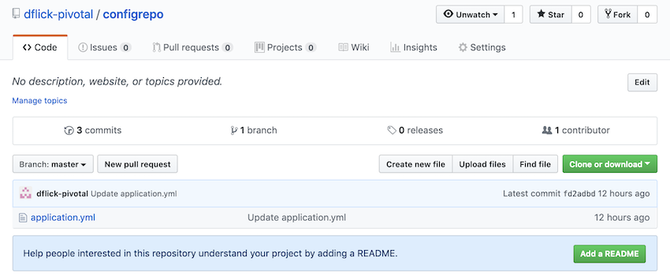
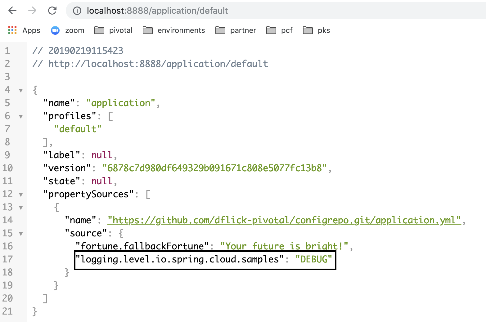
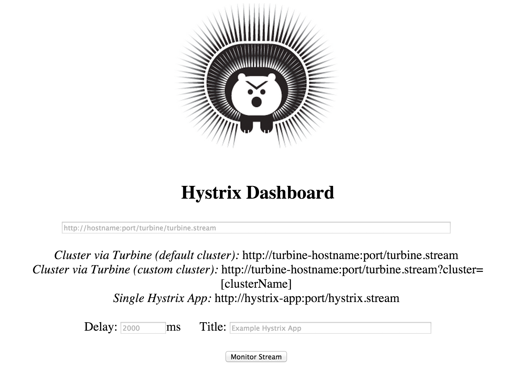
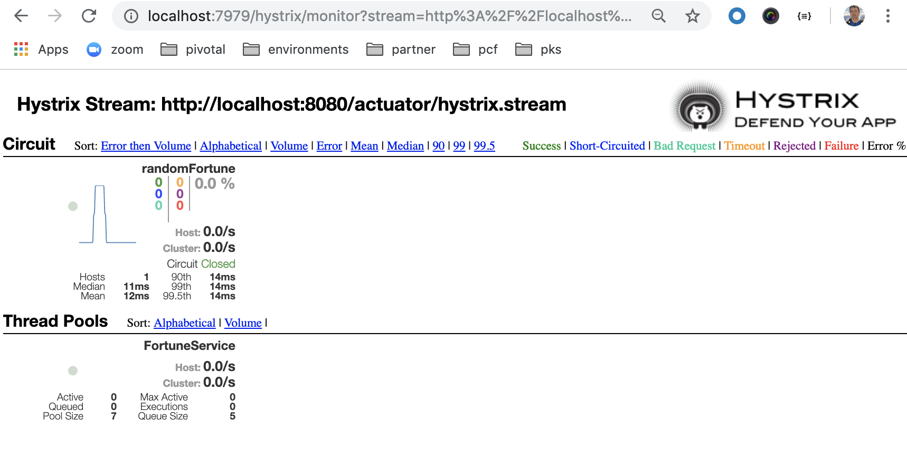
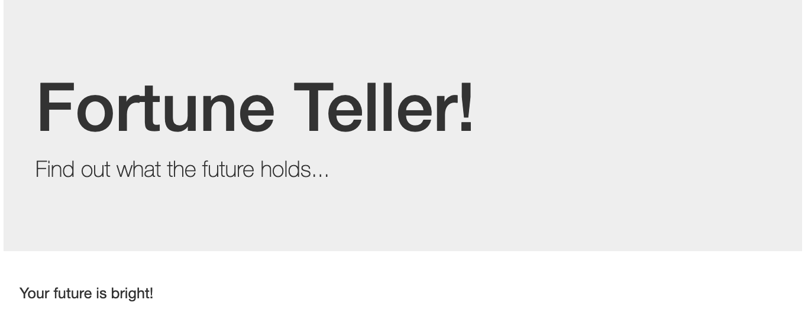
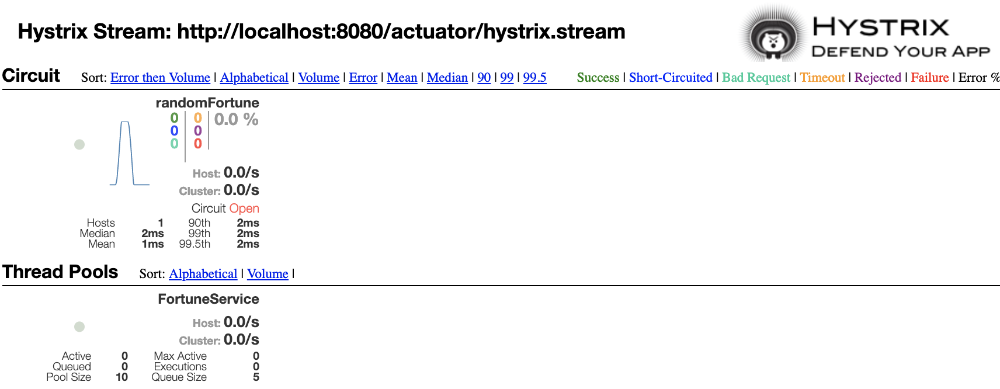

:compat-mode:
= Lab 4 - Operating Cloud Native Architectures with Spring Cloud

_A completed version of this lab is found at `$COURSE_HOME/labs/complete/fortune-teller`._

In this lab we're going to leverage some of the operability helps provided by Spring Cloud to monitor, manage, and troubleshoot our Fortune Teller application.
We'll work with the following:

- https://cloud.spring.io/spring-cloud-config/[Spring Cloud Bus], which enables us to refresh the configuration values used by our microservices without restarting or redeploying them.
- https://github.com/Netflix/Hystrix/wiki/Dashboard[Hystrix Dashboard], which enables us to monitor the status of our application's circuit breakers.
- http://zipkin.io/[Zipkin], which enables us to determine the sources of latency in our microservice call graphs.

== Setting up the Cloud Bus

Because everyone in the class will be pushing configuration changes to GitHub, you'll need your own fork of the config repository.

. Visit https://github.com/dflick-pivotal/configrepo in a browser and click on *Fork*:
+

. Once your fork is completed, grab the clone URL
+

. Clone your `config-repo` fork with a command similar to the following, but substituting the location of your fork:
+
----
$ git clone https://github.com/student/configrepo.git
----

. Now we need to point our Config Server at our forked repo. If you haven't already, shutdown all of the Spring Cloud apps using CTRL-C.

. Open the file `$COURSE_HOME/labs/initial/fortune-teller/config/configserver.yml` in a text editor. Change line 8 to have the location of your fork. Example:
+
----
uri: https://github.com/student/configrepo.git
----

. Now restart the Spring Cloud apps:
+
----
$ spring cloud kafka configserver eureka hystrixdashboard
----

== Changing Log Levels at Runtime

Have you ever been troubleshooting an issue that would no longer manifest after restarting the application, but you also wanted to change the log level?
We now have a solution to that problem!

Let's start out by adding some `DEBUG` level logs to our microservices.

. Begin by adding a `Logger` to `io.spring.cloud.samples.fortuneteller.fortuneservice.FortuneController`:
+
----
Logger logger = LoggerFactory.getLogger(FortuneController.class);
----

. Next, add a `DEBUG` log statement to `FortuneController.randomFortune`:
+
----
logger.debug("Handling request to /random!");
----

. Now add a `Logger` to `io.spring.cloud.samples.fortuneteller.ui.UiController`:
+
----
Logger logger = LoggerFactory.getLogger(UiController.class);
----

. Then, add a `DEBUG` log statement to:
`UiController.randomFortune`:
+
----
logger.debug("Handling request to /random!");
----

. We also need to add the Spring Cloud Bus dependencies to our microservices. Add the following to `pom.xml` for both `fortune-teller-fortune-service` and `fortune-teller-ui`:
+
----
<dependency>
  <groupId>org.springframework.cloud</groupId>
  <artifactId>spring-cloud-starter-bus-kafka</artifactId>
</dependency>
----

. Build and start both the Fortune Service and the Fortune UI.

. Access http://localhost:8080 in the browser. You should *not* see your newly added log messages in either applications' consoles.

. Now it's time to change the log level at runtime. In your locally cloned fork of the config repo, edit the file `application.yml`. Change line 6 such that the logging section now appears as follows:
+
----
logging:
  level:
    io:
      spring:
        cloud:
          samples: DEBUG
----

. Commit your change:
+
----
$ git commit -am "change logging level to DEBUG"

----

. Push your change:
+
----
$ git push origin master
----

. Check if Config Server already got the new config from the repo:
+

. Curl the refresh endpoint of one of your apps to refresh the config in both of your apps via cloud bus
----
curl -X POST http://localhost:8080/actuator/bus-refresh
----
. Access http://localhost:8080 in the browser. You *should* see your newly added log messages in both applications' consoles (e.g.):
+
----
2019-02-19 12:06:09.408 DEBUG 5217 --- [nio-8081-exec-9] i.s.c.s.f.f.c.FortuneController          : Handling request to /random!
----

. Leave both fortune applications running for the next set of exercises!

== Hystrix Dashboard

You should already have the Hystrix Dashboard running based on the `spring cloud` command that you ran during the *Cloud Bus* exercise.

. Visit http://localhost:7979.
You should see output similar to the following:
+

. Paste http://localhost:8080/actuator/hystrix.stream into the text field and click *Monitor Stream*.
You should see output similar to the following:
+

. In a browser, access the fortune-teller-ui application at http://localhost:8080 and show that the circuit breaker is registering successful requests.

. Stop the fortune-teller-fortune-service application.

. Access the fortune-teller-ui application at http://localhost:8080, see that the ``fallback fortune'' is being returned, and show that the circuit breaker is registering short-circuited requests.
+

+

. Restart the fortune-teller-fortune-service application.

. Continue to access the fortune-teller-ui and watch the dashboard.
After the fortune-teller-fortune-service has re-registered with Eureka and the fortune-teller-ui load balancer caches are refreshed, you will see the circuit breaker recover.
You should then start getting random fortunes again!

== Swapping Out Fallback Behavior with Cloud Bus

The Spring Cloud Bus is not only useful for swapping out log levels. Let's use it to swap out a developer defined property instead.

. Take a look at `io.spring.cloud.samples.fortuneteller.ui.FortuneProperties`:
+
----
@ConfigurationProperties(prefix = "fortune") // <1>
@RefreshScope // <2>
public class FortuneProperties {

    private String fallbackFortune = "Your future is unclear."; // <3>

    public String getFallbackFortune() {
        return fallbackFortune;
    }

    public void setFallbackFortune(String fallbackFortune) {
        this.fallbackFortune = fallbackFortune;
    }

}
----
<1> `FortuneProperties` is annotated as a `@ConfigurationProperties` object. These objects provide a type-safe mechanism for handling configuration. Learn more from the following  http://docs.spring.io/spring-boot/docs/current/reference/html/boot-features-external-config.html#boot-features-external-config-typesafe-configuration-properties[documentation].
<2> `FortuneProperties` is also scoped as `@RefreshScope`. This will cause it to be reinitialized based on configuration changes. Learn more from the following http://cloud.spring.io/spring-cloud-static/spring-cloud.html#_refresh_scope[documentation].
<3> `fallbackFortune` has a default value that is equivalent to what we have in our config repo. Config Server configuration overrides any local configuration by default, so this value is not actually causing the runtime behavior of our app at this time.

. Stop the `fortune-teller-fortune-service` application.

. Access the fortune-teller-ui application at http://localhost:8080, see that the ``fallback fortune'' is being returned.
+

. In your local clone of the config repo fork, edit line 9 such that the `fortune` section looks like the following:
+
----
fortune:
  fallbackFortune: Today is your lucky day!
----

. Save, commit, and push your changes to GitHub.

. Refreshed the app config via:
----
http://localhost:8080/actuator/bus-refresh endpoint you should see the new fallback.
----

. Access the fortune-teller-ui application at http://localhost:8080, see that the new ``fallback fortune'' is being returned.
+

== Correlated Logs with Spring Cloud Sleuth

Now we're going to look at how to correlate logs across a call graph using Spring Cloud Sleuth, which automatically instruments Spring Cloud applications and adds correlation information to our logs.

To look at the latency involved in a call graph, we're interested in four events:

- *Client Send (CS):* the client sends a call to the remote service
- *Server Receive (SR):* the call is received by the remote service and work begins
- *Server Send (SS):* the server has completed work and responds to the client
- *Client Receive (CR):* the client receives the response from the remote service

Correlating these four events will help us determine how long an operation took and what the potential sources of latency are.

. Add the following dependency to the `pom.xml` of both `fortune-teller-fortune-service` and `fortune-teller-ui`:
+
----
<dependency>
  <groupId>org.springframework.cloud</groupId>
  <artifactId>spring-cloud-starter-zipkin</artifactId>
</dependency>
----
+
This dependency is for Zipkin, but it adds the Sleuth dependencies transitively, and we'll need Zipkin for the next exercise.

. Let's add some logs representing our events of interest. In `fortune-teller-ui`, add a `Logger` to `io.spring.cloud.samples.fortuneteller.ui.FortuneService`:
+
----
Logger logger = LoggerFactory.getLogger(FortuneService.class);
----

. Edit the definition of `FortuneService.randomFortune` to include logs for client send and client receive events:
+
----
@HystrixCommand(fallbackMethod = "fallbackFortune")
public Fortune randomFortune() {
  logger.info("CS: calling http://fortunes/random.");
  Fortune fortune = restTemplate.getForObject("http://fortunes/random", Fortune.class);
  logger.info("CR: received response from http://fortunes/random.");
  return fortune;
}
----

. In `fortune-teller-fortune-service`, edit the definition of `io.spring.cloud.samples.fortuneteller.fortuneservice.FortuneController.randomFortune` to include logs for server receive and server send events:
+
----
@RequestMapping("/random")
public Fortune randomFortune() {
  logger.debug("Handling request to /random!");
  logger.info("SR: received call to /random.");
  List<Fortune> randomFortunes = repository.randomFortunes(new PageRequest(0, 1));
  logger.info("SS: responding to call to /random.");
  return randomFortunes.get(0);
}
----

. Rebuild and restart both applications.

. Access http://localhost:8080 in the browser. You should see the correlated log events in each applications' logs:
+
.fortune-teller-ui
----
2016-10-16 14:06:31.625  INFO [ui,d64d19d2235e760,1c25e1b87727b7ae,false] 79564 --- [rtuneService-10] i.s.c.s.fortuneteller.ui.FortuneService  : CS: calling http://fortunes/random.
2016-10-16 14:06:31.631  INFO [ui,d64d19d2235e760,1c25e1b87727b7ae,false] 79564 --- [rtuneService-10] i.s.c.s.fortuneteller.ui.FortuneService  : CR: received response from http://fortunes/random.
----
+
.fortune-teller-fortune-service
----
2016-10-16 14:06:31.628  INFO [fortunes,d64d19d2235e760,6b492a088a2ea3f2,false] 79517 --- [nio-8080-exec-7] i.s.c.s.f.f.FortuneController            : SR: received call to /random.
2016-10-16 14:06:31.629  INFO [fortunes,d64d19d2235e760,6b492a088a2ea3f2,false] 79517 --- [nio-8080-exec-7] i.s.c.s.f.f.FortuneController            : SS: responding to call to /random.
----
+
Pay attention to the section of the log statement that appears in square brackets immediately after the log level:
+
----
[fortunes,d64d19d2235e760,6b492a088a2ea3f2,false]
----
+
The tokens represent the following:
+
1. The application name (`fortunes`)
2. The trace ID (`d64d19d2235e760`)
3. The span ID (`6b492a088a2ea3f2`)
4. Should this trace be exported to Zipkin (`false`)
+
To learn more about this terminology, see this http://cloud.spring.io/spring-cloud-static/spring-cloud.html#_features_2[section] of the Spring Cloud Sleuth documentation.
