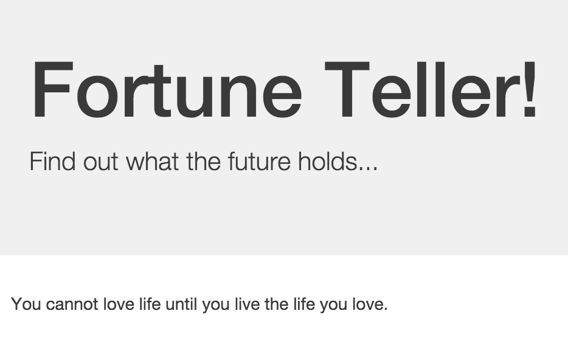
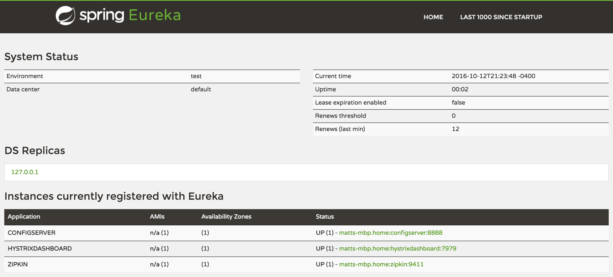
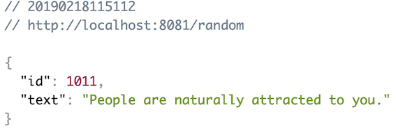

:compat-mode:
= Lab 4 - Composing Cloud Native Architectures with Spring Cloud

_A completed version of this lab is found at `$COURSE_HOME/labs/complete/fortune-teller`._

In this lab we're going to build a Fortune Teller application from two microservices, one that serves up random Chinese fortune cookie fortunes, and one that presents a user interface.
The resulting application looks like the following screenshot:

We'll leverage libraries and services from Spring Cloud and Netflix OSS to help us compose the system.

== Bootstrapping

. Import the project's `pom.xml`, found at `$COURSE_HOME/labs/initial/fortune-teller` into your IDE of choice.

. At the command line, change directories to `$COURSE_HOME/labs/initial/fortune-teller`.

. Run the following command:
+
----
$ spring cloud kafka configserver eureka hystrixdashboard
----
+
This command will helpfully start up the following components for us:
+
- https://kafka.apache.org/[Apache Kafka]
- https://cloud.spring.io/spring-cloud-config/[Spring Cloud Config Server]
- https://github.com/Netflix/eureka/wiki[Netflix OSS Eureka]
- https://github.com/Netflix/Hystrix/wiki/Dashboard[Netflix OSS Hystrix Dashboard]
- http://zipkin.io/[Zipkin]

+
We'll use all of these components to help us compose and operate our Fortune Teller application.

== Config Server

. Browse the file https://github.com/dflick-pivotal/configrepo/blob/master/application.yml. This file contains a fallback message for our fortune service.

. Browse to http://localhost:8888/application/default.
You should see output similar to the following:
+
----
{
  "name": "application",
  "profiles": [
    "default"
  ],
  "label": null,
  "version": "a4491ed1d72ddf23a9bdf5ceefc2ca1b30a4d490",
  "state": null,
  "propertySources": [
    {
      "name": "https://github.com/dflick-pivotal/configrepo.git/application.yml",
      "source": {
        "fortune.fallbackFortune": "Your future is bright!"
      }
    }
  ]
}
----
+
Note that the response JSON defines a Spring `PropertySource` that contains configuration consistent with what you saw in the Git repository.

== Eureka Server

. Browse to http://localhost:8761.
You should see a UI similar to the following:
+

== Fortune Service

Now that our Spring Cloud/Netflix OSS infrastructure is bootstrapped, we'll begin development of our first microservice.
The Fortune Service will serve up a list of all fortune cookie fortunes present in its database or a single random fortune.

. Create a JPA domain class, `io.spring.cloud.samples.fortuneteller.fortuneservice.Fortune`.
Into that class, paste the following code:
+
----
@Entity
@Table(name = "fortunes")
public class Fortune {

    @Id
    @GeneratedValue
    private Long id;

    @Column(nullable = false)
    private String text;

    public Long getId() {
        return id;
    }

    public void setId(Long id) {
        this.id = id;
    }

    public String getText() {
        return text;
    }

    public void setText(String text) {
        this.text = text;
    }
}
----
+
Add the appropriate imports using the IDE's quick fix feature.
+
This class represents the domain model for a fortune, having an unique identifier and the fortune's text.

. Create a Spring Data JPA repository interface, `io.spring.cloud.samples.fortuneteller.fortuneservice.FortuneRepository`.
Into that class, paste the following code:
+
----
public interface FortuneRepository extends PagingAndSortingRepository<Fortune, Long> {

    @Query("select fortune from Fortune fortune order by RAND()")
    public List<Fortune> randomFortunes(Pageable pageable);
}
----
+
Add the appropriate imports using the IDE's quick fix feature.
+
This interface will provide all of the basic boilerplate CRUD features we'll want for our `Fortune` domain class.
The `@Query` annotation defines a SQL statement that will return a random ordering of the fortunes.
We'll use this as the basis of returning a random fortune via our REST interface.

. Create a Spring MVC Controller class, `io.spring.cloud.samples.fortuneteller.fortuneservice.FortuneController`.
Into that class, paste the following code:
+
----
@RestController
public class FortuneController {

    @Autowired
    FortuneRepository repository;

    @RequestMapping("/fortunes")
    public Iterable<Fortune> fortunes() {
        return repository.findAll();
    }

    @RequestMapping("/random")
    public Fortune randomFortune() {
        List<Fortune> randomFortunes = repository.randomFortunes(new PageRequest(0, 1));
        return randomFortunes.get(0);
    }
}
----
+
Add the appropriate imports using the IDE's quick fix feature.
+
This class provides the two REST endpoints of our microservice.
The `randomFortune` method provides a `PageRequest` to limit the returned results to one.

. Add `@EnableDiscoveryClient` (to switch on Eureka registration) annotations to `io.spring.cloud.samples.fortuneteller.fortuneservice.Application`.

. Paste the following configuration properties into the file `src/main/resources/bootstrap.yml`:
+
----
spring:
  application:
    name: fortunes
----
+
This configuration specifies the name of the application, which will be used to register the service in Eureka.

. Paste the following configuration properties into the file `src/main/resources/application.yml`:
+
----
spring:
  jpa:
    hibernate:
      ddl-auto: create-drop

ribbon:
  IsSecure: false

management:
  endpoints:
    web:
      exposure:
        include: "*"

server:
  port: 8081
----
+
This configuration specifies the model to DDL setting to be used by Hibernate.

. Build the application:
+
----
$ ../mvnw package
----

. Run the application:
+
----
$ java -jar fortune-teller-fortune-service/target/fortune-teller-fortune-service-0.0.1-SNAPSHOT.jar
----

. After the service has been running for ten seconds, refresh your Eureka browser tab.
You should see a registration entry for the fortune service.

. Visit http://localhost:8081/random. You should see output similar to the following:
+

== Fortune UI

Now that our Fortune microservice is running, we'll begin development of our second microservice.
The Fortune UI will serve up a AngularJS single page application that consumes the fortune service.

. Create the POJO `io.spring.cloud.samples.fortuneteller.ui.Fortune`.
Into that class, paste the following code:
+
----
public class Fortune {
    private Long id;
    private String text;

    public Fortune() {
    }

    public Fortune(Long id, String text) {
        this.id = id;
        this.text = text;
    }

    public Long getId() {
        return id;
    }

    public void setId(Long id) {
        this.id = id;
    }

    public String getText() {
        return text;
    }

    public void setText(String text) {
        this.text = text;
    }
}
----
+
We will use this class to unmarshal the response from the fortune service.

. Create the Spring Bean `io.spring.cloud.samples.fortuneteller.ui.FortuneProperties`. Into that class, paste the following code:
+
----
@ConfigurationProperties(prefix = "fortune")
@RefreshScope
public class FortuneProperties {

	private String fallbackFortune = "Your future is unclear.";

	public String getFallbackFortune() {
		return fallbackFortune;
	}

	public void setFallbackFortune(String fallbackFortune) {
		this.fallbackFortune = fallbackFortune;
	}

}
----

. Create the Spring Bean `io.spring.cloud.samples.fortuneteller.ui.FortuneService`.
Into that class, paste the following code:
+
----
@Service
@EnableConfigurationProperties(FortuneProperties.class)
public class FortuneService {

    @Autowired
    FortuneProperties fortuneProperties;

    @Autowired
    @LoadBalanced
    RestTemplate restTemplate;

    @HystrixCommand(fallbackMethod = "fallbackFortune")
    public Fortune randomFortune() {
        return restTemplate.getForObject("http://fortunes/random", Fortune.class);
    }

    private Fortune fallbackFortune() {
        return new Fortune(42L, fortuneProperties.getFallbackFortune());
    }
}
----
+
Add the appropriate imports using the IDE's quick fix feature.
+
This class is our integration point with the fortune service.
It uses a special `RestTemplate` bean that integrates with Ribbon from Netflix OSS.
The argument passed to `getForObject`, `http://fortunes/random`, will be resolved by Ribbon to the actual address of the fortune service.
This method is also protected by a Hystrix circuit breaker using the `@HystrixCommand` annotation.
If the circuit is tripped to open (due to an unhealthy fortune service), the `fallbackFortune` method will return a dummy response.

. Create a Spring MVC Controller class, `io.spring.cloud.samples.fortuneteller.ui.UiController`.
Into that class, paste the following code:
+
----
@RestController
public class UiController {

    @Autowired
    FortuneService service;

    @RequestMapping("/random")
    public Fortune randomFortune() {
        return service.randomFortune();
    }
}
----
+
Add the appropriate imports using the IDE's quick fix feature.
+
This class provides the REST endpoint that will be consumed by our AngularJS UI.

. Add `@EnableCircuitBreaker` (to switch on Hystrix circuit breakers) and `@EnableDiscoveryClient` (to switch on Eureka registration) annotations to `io.spring.cloud.samples.fortuneteller.ui.Application`.

. Also add the following code to `io.spring.cloud.samples.fortuneteller.ui.Application` to instruct Spring Cloud Netflix to create a load-balanced `RestTemplate`:
+
----
@Bean
@LoadBalanced
public RestTemplate restTemplate() {
  return new RestTemplate();
}
----

. Paste the following configuration properties into the file `src/main/resources/bootstrap.yml`:
+
----
spring:
  application:
    name: ui
----
+
This configuration specifies the name of the application, which will be used to register the service in Eureka.

. Paste the following configuration properties into the file `src/main/resources/application.yml`:
+
----
ribbon:
  isSecure: false

management:
  endpoints:
    web:
      exposure:
        include: "*"
----
+

. Build the application:
+
----
$ ./mvnw package
----

. Run the application:
+
----
$ java -jar fortune-teller-ui/target/fortune-teller-ui-0.0.1-SNAPSHOT.jar
----

. After the service has been running for ten seconds, refresh your Eureka browser tab.
You should see a registration entry for the Fortune UI.

. Visit http://localhost:8080. You should see output similar to the following:
+

