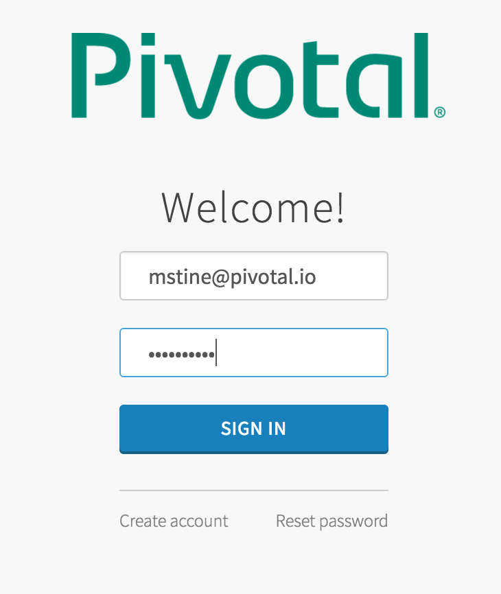
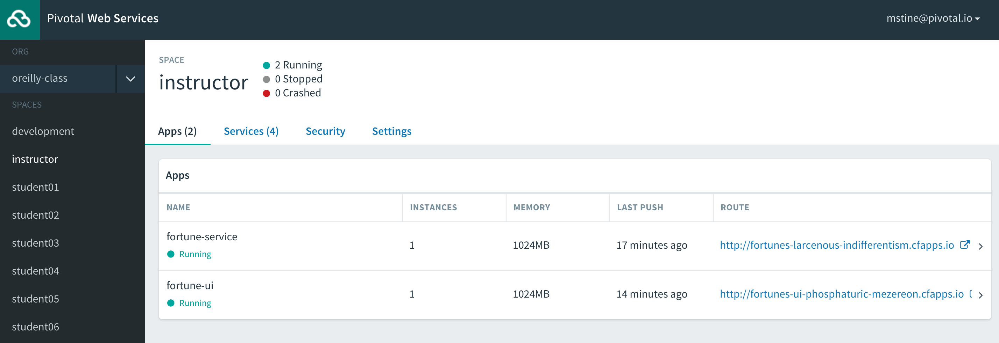
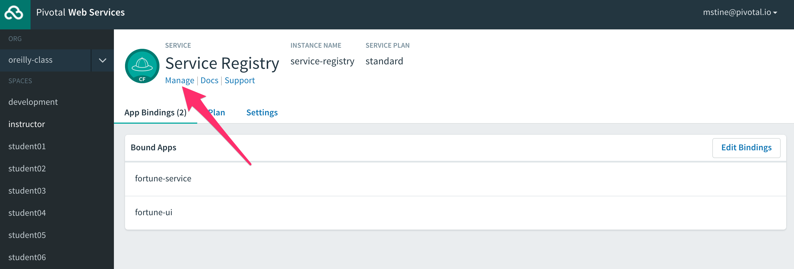
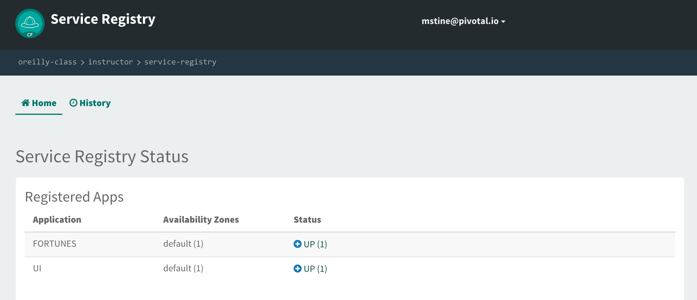
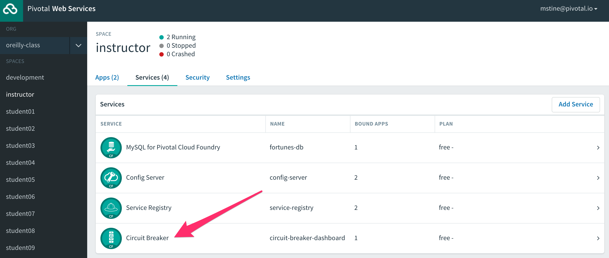
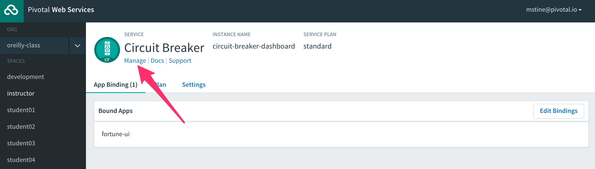

:compat-mode:
= Lab 5 - Deploying Cloud Native Architectures to Cloud Foundry

_A completed version of this lab is found at `$COURSE_HOME/labs/complete/fortune-teller-cf`._

Cloud Foundry is an open source platform for running cloud native application architectures. It operates under the tenants of the Cloud Foundry haiku:

____
Here is my code.

Run it on the cloud for me.

I do not care how.
____

Cloud Foundry does the work of analyzing your application and determining its runtime needs through a process called `cf push`, which uploads your code and launches a _buildpack_ to create a runtime package including things like a JDK. This package, called a _droplet_ is launched in a Linux container using the same underlying technology as Docker. Cloud Foundry also handles _provisioning_ of and _binding_ your application to marketplace services like databases, as well as other non-functional concerns like aggregating and providing access to application metrics and logs.

In this lab, we'll leverage _Spring Cloud Services (SCS)_, which is a Cloud Foundry marketplace version of the same services you ran on your laptop. These services are made available via _Pivotal Web Services (PWS)_, which is a SaaS version of Cloud Foundry operated by Pivotal.

== Dependency Changes

First, we'll make a few changes to the dependencies present in your applications. We'll be removing the Cloud Bus Kafka and Zipkin dependencies, as these services are not yet available on PWS. Also, we'll leverage some SCS specific starters. They are a superset of the starters you already used for Spring Cloud OSS, and include features such as opinionated security based on Cloud Foundry service bindings.

. First we need to change our parent pom's parent, at `${COURSE_HOME}/labs/initial/fortune-teller/pom.xml`:
+
----
<parent>
    <groupId>org.springframework.boot</groupId>
    <artifactId>spring-boot-starter-parent</artifactId>
    <version>1.4.2.RELEASE</version>
    <relativePath/>
</parent>
----

. Next, we need to alter the dependency management block of the parent pom, at `${COURSE_HOME}/labs/initial/fortune-teller/pom.xml`:
+
----
<dependencyManagement>
  <dependencies>
		<dependency>
			<groupId>org.springframework.cloud</groupId>
			<artifactId>spring-cloud-dependencies</artifactId>
			<version>Camden.SR4</version>
			<type>pom</type>
			<scope>import</scope>
		</dependency>
		<dependency>
			<groupId>io.pivotal.spring.cloud</groupId>
			<artifactId>spring-cloud-services-dependencies</artifactId>
			<version>1.4.1.RELEASE</version>
			<type>pom</type>
			<scope>import</scope>
		</dependency>
	</dependencies>
</dependencyManagement>
----

. In `fortune-teller-fortune-service/pom.xml`, replace all of the dependencies matching the pattern `spring-cloud-starter-*` with these SCS dependencies:
+
----
<dependency>
  <groupId>io.pivotal.spring.cloud</groupId>
  <artifactId>spring-cloud-services-starter-config-client</artifactId>
</dependency>
<dependency>
  <groupId>io.pivotal.spring.cloud</groupId>
  <artifactId>spring-cloud-services-starter-service-registry</artifactId>
</dependency>
----

. In `fortune-teller-ui/pom.xml`, replace all of the dependencies matching the pattern `spring-cloud-starter-*` with these SCS dependencies:
+
----
<dependency>
  <groupId>io.pivotal.spring.cloud</groupId>
  <artifactId>spring-cloud-services-starter-config-client</artifactId>
</dependency>
<dependency>
  <groupId>io.pivotal.spring.cloud</groupId>
  <artifactId>spring-cloud-services-starter-service-registry</artifactId>
</dependency>
<dependency>
  <groupId>io.pivotal.spring.cloud</groupId>
  <artifactId>spring-cloud-services-starter-circuit-breaker</artifactId>
</dependency>
----

== Build and Push!

. Using Maven, build and package the application:
+
----
$ ./mvnw package
----

. Login to PWS using the Cloud Foundry CLI, and target the space you were assigned in the class spreadsheet:
+
----
$ cf api api.run.pivotal.io
Setting api endpoint to api.run.pivotal.io...
OK

API endpoint:   https://api.run.pivotal.io (API version: 2.63.0)
Not logged in. Use 'cf login' to log in.

$ cf login
API endpoint: https://api.run.pivotal.io

Email> mstine@pivotal.io

Password>
Authenticating...
OK

Select an org (or press enter to skip):
1. mstine-org
2. oreilly-class

Org> 2
Targeted org oreilly-class

Select a space (or press enter to skip):
1. development
2. instructor
3. student01
4. student02
5. student03
6. student04
7. student05
8. student06
9. student07
10. student08
11. student09
12. student10
13. student11
14. student12
15. student13
16. student14
17. student15
18. student16
19. student17
20. student18
21. student19
22. student20
23. student21
24. student22
25. student23
26. student24
27. student25

Space> 2
Targeted space instructor

API endpoint:   https://api.run.pivotal.io (API version: 2.63.0)
User:           mstine@pivotal.io
Org:            oreilly-class
Space:          instructor
----

. Next, we'll use a script to create instances of each of the marketplace services that we need. Take a look at `scripts/create_services.sh`:
+
----
#!/usr/bin/env bash

cf cs p-mysql 100mb fortunes-db
cf cs p-config-server standard config-server -c '{"git": { "uri": "https://github.com/mstine/config-repo" } }'
cf cs p-service-registry standard service-registry
cf cs p-circuit-breaker-dashboard standard circuit-breaker-dashboard
----
+
This script is creating each of the following:
+
- A MySQL database
- A Config Server, pointing to a Git repository (if you like, point at your own fork by editing the script!)
- A Service Registry, based on Eureka
- A Circuit Breaker Dashboard, based on the Hystrix Dashboard
+
The SCS services are provisioned asynchronously, so you'll need to check on their status before continuing.

. Execute the script:
+
----
$ scripts/create_services.sh
Creating service instance fortunes-db in org oreilly-class / space instructor as mstine@pivotal.io...
OK
Creating service instance config-server in org oreilly-class / space instructor as mstine@pivotal.io...
OK

Create in progress. Use 'cf services' or 'cf service config-server' to check operation status.
Creating service instance service-registry in org oreilly-class / space instructor as mstine@pivotal.io...
OK

Create in progress. Use 'cf services' or 'cf service service-registry' to check operation status.
Creating service instance circuit-breaker-dashboard in org oreilly-class / space instructor as mstine@pivotal.io...
OK

Create in progress. Use 'cf services' or 'cf service circuit-breaker-dashboard' to check operation status.
----
+
Then check the status of all services:
+
----
$ cf services
Getting services in org oreilly-class / space instructor as mstine@pivotal.io...
OK

name                        service                       plan       bound apps   last operation
circuit-breaker-dashboard   p-circuit-breaker-dashboard   standard                create in progress
config-server               p-config-server               standard                create in progress
fortunes-db                 p-mysql                       100mb                   create succeeded
service-registry            p-service-registry            standard                create in progress
----
+
You'll want to keep executing this command (e.g. by using the UNIX command `watch`) until all of the services have the status `create succeeded`:
+
----
$ cf s
Getting services in org oreilly-class / space instructor as mstine@pivotal.io...
OK

name                        service                       plan       bound apps   last operation
circuit-breaker-dashboard   p-circuit-breaker-dashboard   standard                create succeeded
config-server               p-config-server               standard                create succeeded
fortunes-db                 p-mysql                       100mb                   create succeeded
service-registry            p-service-registry            standard                create succeeded
----

. Next we'll use `cf push` to push the `fortune-teller` applications. Take a look at `fortune-teller/manifest.yml` (look for numbered annotations in the listing):
+
----
applications:
- name: fortune-service # <1>
  memory: 1024M # <2>
  host: fortunes-${random-word} # <3>
  path: fortune-teller-fortune-service/target/fortune-teller-fortune-service-0.0.1-SNAPSHOT.jar # <4>
  services: # <5>
  - fortunes-db
  - config-server
  - service-registry
- name: fortune-ui
  memory: 1024M
  host: fortunes-ui-${random-word}
  path: fortune-teller-ui/target/fortune-teller-ui-0.0.1-SNAPSHOT.jar
  services:
  - config-server
  - service-registry
  - circuit-breaker-dashboard
env: # <6>
  CF_TARGET: https://api.run.pivotal.io
----
<1> Gives the application a name unique to your space.
<2> Sets the maximum available memory in the Linux container allocated to your application.
<3> Give the application a hostname. The hostname must be unique to the domain you're using (in this case, `cfapps.io`), so `${random-word}` will attach a randomly generated token from a dictionary.
<4> Indicates the application artifact (in this case, your Spring Boot jar file) to be uploaded.
<5> Indicates the services that should be bound to your application.
<6> Indicates environment variables to be set in the environment of your running application process.

. Push the applications. This command will automatically pickup a `manifest.yml` file if present in the current directory (look for numbered annotations in the listing):
+
----
$ cf push
Using manifest file /Users/mstine/personal/2016/2016_CloudNativeAppArchWorkshop/labs/complete/fortune-teller-cf/manifest.yml

Creating app fortune-service in org oreilly-class / space instructor as mstine@pivotal.io... // <1>
OK

Creating route fortunes-larcenous-indifferentism.cfapps.io... // <2>
OK

Binding fortunes-larcenous-indifferentism.cfapps.io to fortune-service... // <3>
OK

Uploading fortune-service... // <4>
Uploading app files from: /var/folders/lw/4n6b80d97d528w14f6jv7hgr0000gn/T/unzipped-app320499011
Uploading 1.3M, 136 files
Done uploading
OK
Binding service fortunes-db to app fortune-service in org oreilly-class / space instructor as mstine@pivotal.io... // <5>
OK
Binding service config-server to app fortune-service in org oreilly-class / space instructor as mstine@pivotal.io...
OK
Binding service service-registry to app fortune-service in org oreilly-class / space instructor as mstine@pivotal.io...
OK

Starting app fortune-service in org oreilly-class / space instructor as mstine@pivotal.io... // <6>
Downloaded ruby_buildpack
Downloading dotnet_core_buildpack_beta...
Downloaded python_buildpack
Downloading dotnet_core_buildpack...
Downloaded dotnet_core_buildpack
Downloaded dotnet_core_buildpack_beta
Downloaded nodejs_buildpack
Downloaded go_buildpack
Downloaded php_buildpack
Creating container
Successfully created container
Downloading app package...
Downloaded app package (50.2M)
Staging...
-----> Java Buildpack Version: v3.9 (offline) | https://github.com/cloudfoundry/java-buildpack.git#b050954 // <7>
-----> Downloading Open Jdk JRE 1.8.0_101 from https://java-buildpack.cloudfoundry.org/openjdk/trusty/x86_64/openjdk-1.8.0_101.tar.gz (found in cache)
       Expanding Open Jdk JRE to .java-buildpack/open_jdk_jre (1.0s)
-----> Downloading Open JDK Like Memory Calculator 2.0.2_RELEASE from https://java-buildpack.cloudfoundry.org/memory-calculator/trusty/x86_64/memory-calculator-2.0.2_RELEASE.tar.gz (found in cache)
       Memory Settings: -Xss349K -Xmx681574K -XX:MaxMetaspaceSize=104857K -Xms681574K -XX:MetaspaceSize=104857K // <8>
-----> Downloading Spring Auto Reconfiguration 1.10.0_RELEASE from https://java-buildpack.cloudfoundry.org/auto-reconfiguration/auto-reconfiguration-1.10.0_RELEASE.jar (found in cache)
Staging complete
Uploading droplet, build artifacts cache...
Uploading build artifacts cache...
Uploading droplet... // <9>
Uploaded build artifacts cache (108B)
Uploaded droplet (95.3M)
Uploading complete
Destroying container
Successfully destroyed container // <10>

0 of 1 instances running, 1 starting // <11>
0 of 1 instances running, 1 starting
0 of 1 instances running, 1 starting
0 of 1 instances running, 1 starting
0 of 1 instances running, 1 starting
0 of 1 instances running, 1 starting
0 of 1 instances running, 1 starting
0 of 1 instances running, 1 starting
0 of 1 instances running, 1 starting
0 of 1 instances running, 1 starting
0 of 1 instances running, 1 starting
0 of 1 instances running, 1 starting
1 of 1 instances running

App started

OK

App fortune-service was started using this command `CALCULATED_MEMORY=$($PWD/.java-buildpack/open_jdk_jre/bin/java-buildpack-memory-calculator-
2.0.2_RELEASE -memorySizes=metaspace:64m..,stack:228k.. -memoryWeights=heap:65,metaspace:10,native:15,stack:10 -memoryInitials=heap:100%,metasp
ace:100% -stackThreads=300 -totMemory=$MEMORY_LIMIT) && JAVA_OPTS="-Djava.io.tmpdir=$TMPDIR -XX:OnOutOfMemoryError=$PWD/.java-buildpack/open_jd
k_jre/bin/killjava.sh $CALCULATED_MEMORY" && SERVER_PORT=$PORT eval exec $PWD/.java-buildpack/open_jdk_jre/bin/java $JAVA_OPTS -cp $PWD/. org.s
pringframework.boot.loader.JarLauncher` // <12>

Showing health and status for app fortune-service in org oreilly-class / space instructor as mstine@pivotal.io...
OK // <13>

requested state: started
instances: 1/1
usage: 1G x 1 instances
urls: fortunes-larcenous-indifferentism.cfapps.io
last uploaded: Wed Oct 19 00:05:14 UTC 2016
stack: cflinuxfs2
buildpack: java-buildpack=v3.9-offline-https://github.com/cloudfoundry/java-buildpack.git#b050954 java-main open-jdk-like-jre=1.8.0_101 open-jd
k-like-memory-calculator=2.0.2_RELEASE spring-auto-reconfiguration=1.10.0_RELEASE

     state     since                    cpu      memory         disk           details
#0   running   2016-10-19 01:07:23 AM   146.0%   508.7M of 1G   179.8M of 1G
Creating app fortune-ui in org oreilly-class / space instructor as mstine@pivotal.io... // <14>
OK

Creating route fortunes-ui-phosphaturic-mezereon.cfapps.io...
OK

Binding fortunes-ui-phosphaturic-mezereon.cfapps.io to fortune-ui...
OK

Uploading fortune-ui...
Uploading app files from: /var/folders/lw/4n6b80d97d528w14f6jv7hgr0000gn/T/unzipped-app655916839
Uploading 1.5M, 149 files
Done uploading
OK
Binding service config-server to app fortune-ui in org oreilly-class / space instructor as mstine@pivotal.io...
OK
Binding service service-registry to app fortune-ui in org oreilly-class / space instructor as mstine@pivotal.io...
OK
Binding service circuit-breaker-dashboard to app fortune-ui in org oreilly-class / space instructor as mstine@pivotal.io...
OK

Starting app fortune-ui in org oreilly-class / space instructor as mstine@pivotal.io...
Downloading binary_buildpack...
Downloading nodejs_buildpack...
Downloading dotnet_core_buildpack...
Downloading python_buildpack...
Downloading go_buildpack...
Downloaded nodejs_buildpack
Downloading php_buildpack...
Downloaded go_buildpack
Downloading dotnet_core_buildpack_beta...
Downloaded dotnet_core_buildpack
Downloading staticfile_buildpack...
Downloaded python_buildpack
Downloading java_buildpack...
Downloaded binary_buildpack
Downloading ruby_buildpack...
Downloaded ruby_buildpack
Downloaded dotnet_core_buildpack_beta
Downloaded staticfile_buildpack
Downloaded php_buildpack
Downloaded java_buildpack
Creating container
Successfully created container
Downloading app package...
Downloaded app package (41.7M)
Staging...
-----> Java Buildpack Version: v3.9 (offline) | https://github.com/cloudfoundry/java-buildpack.git#b050954
-----> Downloading Open Jdk JRE 1.8.0_101 from https://java-buildpack.cloudfoundry.org/openjdk/trusty/x86_64/openjdk-1.8.0_101.tar.gz (found in cache)
       Expanding Open Jdk JRE to .java-buildpack/open_jdk_jre (1.1s)
-----> Downloading Open JDK Like Memory Calculator 2.0.2_RELEASE from https://java-buildpack.cloudfoundry.org/memory-calculator/trusty/x86_64/memory-calculator-2.0.2_RELEASE.tar.gz (found in cache)
       Memory Settings: -XX:MetaspaceSize=104857K -XX:MaxMetaspaceSize=104857K -Xss349K -Xmx681574K -Xms681574K
-----> Downloading Spring Auto Reconfiguration 1.10.0_RELEASE from https://java-buildpack.cloudfoundry.org/auto-reconfiguration/auto-reconfiguration-1.10.0_RELEASE.jar (found in cache)
Exit status 0
Staging complete
Uploading droplet, build artifacts cache...
Uploading build artifacts cache...
Uploading droplet...
Uploaded build artifacts cache (108B)
Uploaded droplet (86.7M)
Uploading complete
Destroying container
Successfully destroyed container

0 of 1 instances running, 1 starting
0 of 1 instances running, 1 starting
0 of 1 instances running, 1 starting
0 of 1 instances running, 1 starting
0 of 1 instances running, 1 starting
1 of 1 instances running

App started

OK

App fortune-ui was started using this command `CALCULATED_MEMORY=$($PWD/.java-buildpack/open_jdk_jre/bin/java-buildpack-memory-calculator-2.0.2
_RELEASE -memorySizes=metaspace:64m..,stack:228k.. -memoryWeights=heap:65,metaspace:10,native:15,stack:10 -memoryInitials=heap:100%,metaspace:1
00% -stackThreads=300 -totMemory=$MEMORY_LIMIT) && JAVA_OPTS="-Djava.io.tmpdir=$TMPDIR -XX:OnOutOfMemoryError=$PWD/.java-buildpack/open_jdk_jre
/bin/killjava.sh $CALCULATED_MEMORY" && SERVER_PORT=$PORT eval exec $PWD/.java-buildpack/open_jdk_jre/bin/java $JAVA_OPTS -cp $PWD/. org.spring
framework.boot.loader.JarLauncher`

Showing health and status for app fortune-ui in org oreilly-class / space instructor as mstine@pivotal.io...
OK

requested state: started
instances: 1/1
usage: 1G x 1 instances
urls: fortunes-ui-phosphaturic-mezereon.cfapps.io
last uploaded: Wed Oct 19 00:07:41 UTC 2016
stack: cflinuxfs2
buildpack: java-buildpack=v3.9-offline-https://github.com/cloudfoundry/java-buildpack.git#b050954 java-main open-jdk-like-jre=1.8.0_101 open-jd
k-like-memory-calculator=2.0.2_RELEASE spring-auto-reconfiguration=1.10.0_RELEASE

     state     since                    cpu      memory         disk         details
#0   running   2016-10-19 01:09:18 AM   217.7%   476.7M of 1G   170M of 1G
----
<1> The application is created via an API call to Cloud Foundry.
<2> A route is created via an API call to Cloud Foundry.
<3> The route is bound to the application. This means any accesses to this route via HTTP will be routed to instances of this application.
<4> The application code is uploaded to the Cloud Foundry blobstore.
<5> Each of the marketplace services created by the script is bound to the application.
<6> The staging process is started.
<7> Cloud Foundry determines that the Java buildpack should be run on this application and starts it.
<8> The Cloud Foundry Java buildpack automatically calculates the JVM memory settings optimal for the chosen maximum memory for the Linux container.
<9> The droplet created by running the Java buildpack is uploaded to the Cloud Foundry blobstore.
<10> The Linux container used to stage the application is destroyed.
<11> A new Linux container is created, and the JVM process is started.
<12> When the process becomes healthy, the CLI reports the command used to start the process.
<13> The CLI finishes the `push` process by reporting on the health and status of the application.
<14> The process completes for each application in the manifest.

. Access http://console.run.pivotal.io in the browser. You'll be redirected to login:
+

. Choose your organization and space from the menu on the left:
+
image::Common/images/pws_2.png[]

. You should see your two applications running:
+

. Click *Services*:
+
image::Common/images/pws_4.png[]

. You'll see the marketplace service instances created by the script here:
+
image::Common/images/pws_5.png[]

. Click *Service Registry*:
+
image::Common/images/pws_6.png[]

. Then click *Manage*:
+

. This should open another browser window/tab. You may be challenged for authentication again. Then you'll see the Service Registry dashboard, along with the registrations for your two apps:
+

. Return to the *Services* screen and click *Circuit Breaker*:
+

. Click *Manage*:
+

. Generate some traffic to your `fortune-teller-ui` application's assigned route. You should see usage in the Circuit Breaker Dashboard:
+
image::Common/images/pws_11.png[]

. You can examine the logs for your applications by using the `cf logs` command:
+
----
$ cf logs fortune-service
cf logs fortune-service
Connected, tailing logs for app fortune-service in org oreilly-class / space instructor as mstine@pivotal.io...

2016-10-19T01:35:02.57+0100 [APP/PROC/WEB/0]OUT 2016-10-19 00:35:02.572  INFO 14 --- [nio-8080-exec-2] i.s.c.s.f.f.FortuneController
 : SR: received call to /random.
2016-10-19T01:35:02.60+0100 [APP/PROC/WEB/0]OUT 2016-10-19 00:35:02.601  INFO 14 --- [nio-8080-exec-2] i.s.c.s.f.f.FortuneController            : SS: responding to call to /random.
2016-10-19T01:35:02.60+0100 [RTR/2]      OUT fortunes-larcenous-indifferentism.cfapps.io - [19/10/2016:00:35:02.569 +0000] "GET /random HTTP/1$1" 200 0 56 "-" "Java/1.8.0_101" 10.10.66.121:11217 x_forwarded_for:"54.83.133.0" x_forwarded_proto:"https" vcap_request_id:62badf23-d93d-4801$4ef5-375f408ee3d0 response_time:0.034239541 app_id:92876397-6bd6-4714-98de-6212d04208fd app_index:0
...
----
