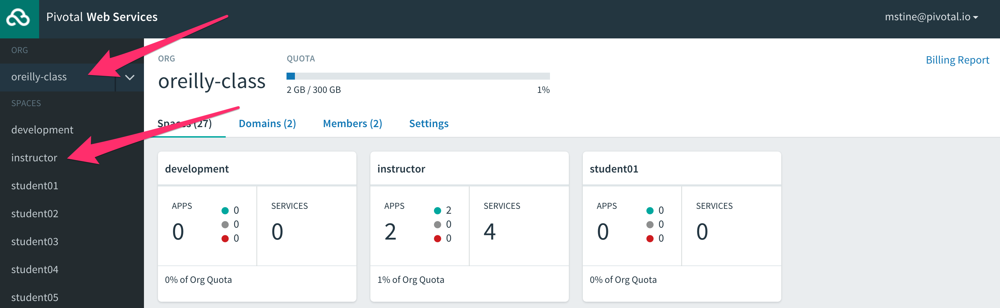
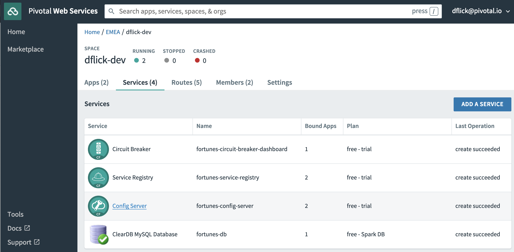
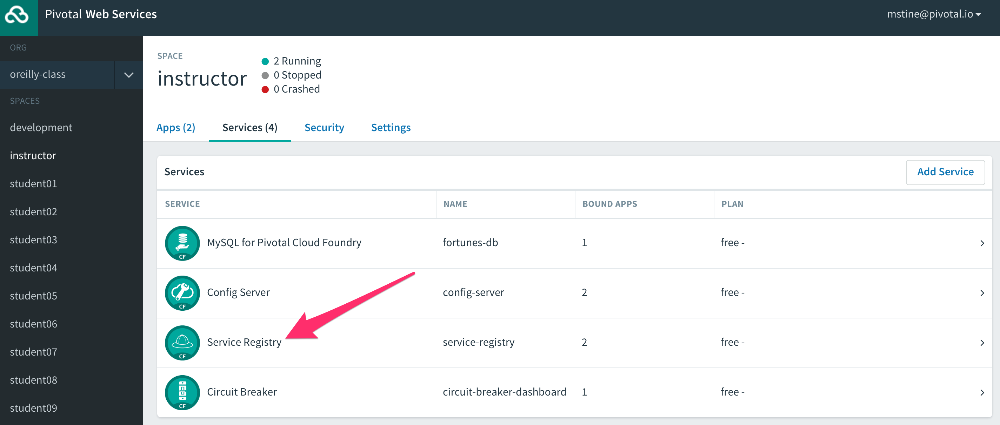
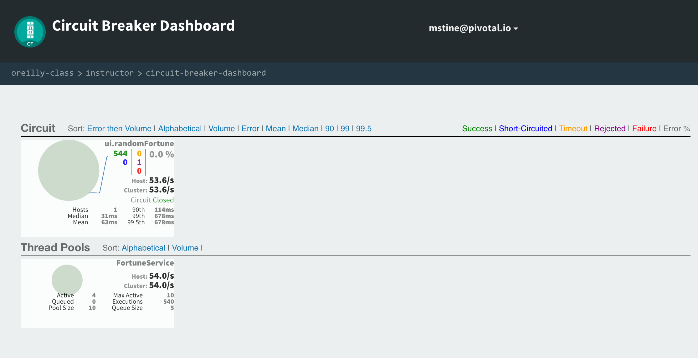

:compat-mode:
= Lab 6 - Deploying Cloud Native Architectures to Cloud Foundry

_A completed version of this lab is found at `$COURSE_HOME/labs/complete/fortune-teller-cf`._

Cloud Foundry is an open source platform for running cloud native application architectures. It operates under the tenants of the Cloud Foundry haiku:

____
Here is my code.

Run it on the cloud for me.

I do not care how.
____

Cloud Foundry does the work of analyzing your application and determining its runtime needs through a process called `cf push`, which uploads your code and launches a _buildpack_ to create a runtime package including things like a JDK. This package, called a _droplet_ is launched in a Linux container using the same underlying technology as Docker. Cloud Foundry also handles _provisioning_ of and _binding_ your application to marketplace services like databases, as well as other non-functional concerns like aggregating and providing access to application metrics and logs.

In this lab, we'll leverage _Spring Cloud Services (SCS)_, which is a Cloud Foundry marketplace version of the same services you ran on your laptop. These services are made available via _Pivotal Web Services (PWS)_, which is a SaaS version of Cloud Foundry operated by Pivotal.

== Dependency Changes

we'll make a few changes to the dependencies present in your applications. We'll be removing the Cloud Bus Kafka and Zipkin dependencies. Also, we'll leverage some SCS specific starters. They are a superset of the starters you already used for Spring Cloud OSS, and include features such as opinionated security based on Cloud Foundry service bindings.

. First, we need to alter the dependency management block of the parent pom, at `${COURSE_HOME}/labs/initial/fortune-teller/pom.xml`:
+
----
<dependencyManagement>
  <dependencies>
    <dependency>
      <groupId>io.pivotal.spring.cloud</groupId>
      <artifactId>spring-cloud-services-dependencies</artifactId>
      <version>2.0.1.RELEASE</version>
      <type>pom</type>
      <scope>import</scope>
    </dependency>
    <dependency>
      <groupId>org.springframework.cloud</groupId>
      <artifactId>spring-cloud-dependencies</artifactId>
      <version>Finchley.RELEASE</version>
      <type>pom</type>
      <scope>import</scope>
    </dependency>
  </dependencies>
</dependencyManagement>
----

. In `fortune-teller-fortune-service/pom.xml`, replace all of the dependencies matching the pattern `spring-cloud-starter-*` with these SCS dependencies:
+
----
<dependency>
  <groupId>io.pivotal.spring.cloud</groupId>
  <artifactId>spring-cloud-services-starter-config-client</artifactId>
</dependency>
<dependency>
  <groupId>io.pivotal.spring.cloud</groupId>
  <artifactId>spring-cloud-services-starter-service-registry</artifactId>
</dependency>
----

. In `fortune-teller-ui/pom.xml`, replace all of the dependencies matching the pattern `spring-cloud-starter-*` with these SCS dependencies:
+
----
<dependency>
  <groupId>io.pivotal.spring.cloud</groupId>
  <artifactId>spring-cloud-services-starter-config-client</artifactId>
</dependency>
<dependency>
  <groupId>io.pivotal.spring.cloud</groupId>
  <artifactId>spring-cloud-services-starter-service-registry</artifactId>
</dependency>
<dependency>
  <groupId>io.pivotal.spring.cloud</groupId>
  <artifactId>spring-cloud-services-starter-circuit-breaker</artifactId>
</dependency>
----

== Build and Push!

. Using Maven, build and package the application:
+
----
$ ./mvnw package
----

. Login to Pivotal Cloud Foundry using the Cloud Foundry CLI, and target the space you were assigned in the class spreadsheet:
+
----
cf login -a api.run.pivotal.io
API endpoint: api.run.pivotal.io

Email> dflick@pivotal.io

Password>
Authenticating...
OK

Select an org (or press enter to skip):
1. dieter-org
2. EMEA

Org> 2
Targeted org EMEA

Select a space (or press enter to skip):
There are too many options to display, please type in the name.

Space> dflick-dev
Targeted space dflick-dev

API endpoint:   https://api.run.pivotal.io (API version: 2.131.0)
User:           dflick@pivotal.io
Org:            EMEA
Space:          dflick-dev
----

. Next, we'll use a script to create instances of each of the marketplace services that we need. Take a look at `scripts/create_services.sh`:
+
----
#!/usr/bin/env bash

cf cs p.mysql db-small fortunes-db
echo "configure your repo !!!!!"
#cf cs p-config-server standard config-server -c '{"skipSslValidation": true, "git": { "uri": "https://github.com/spring-cloud-services-samples/fortune-teller", "searchPaths": "configuration" } }'
cf cs p-config-server standard config-server -c '{"git": { "uri": "https://github.com/dflick-pivotal/configrepo" } }'
cf cs p-service-registry standard service-registry
cf cs p-circuit-breaker-dashboard standard circuit-breaker
----
+
This script is creating each of the following:
+
- A MySQL database
- A Config Server, pointing to a Git repository (if you like, point at your own fork by editing the script!)
- A Service Registry, based on Eureka
- A Circuit Breaker Dashboard, based on the Hystrix Dashboard
+
The SCS services are provisioned asynchronously, so you'll need to check on their status before continuing.

. Execute the script:
+
----
$ scripts/create_services.sh
Creating service instance fortunes-db in org EMEA / space dflick-dev as dflick@pivotal.io...
OK

Creating service instance fortunes-config-server in org EMEA / space dflick-dev as dflick@pivotal.io...
OK

Create in progress. Use 'cf services' or 'cf service fortunes-config-server' to check operation status.

Creating service instance fortunes-service-registry in org EMEA / space dflick-dev as dflick@pivotal.io...
OK

Create in progress. Use 'cf services' or 'cf service fortunes-service-registry' to check operation status.

Creating service instance fortunes-circuit-breaker-dashboard in org EMEA / space dflick-dev as dflick@pivotal.io...
OK

Create in progress. Use 'cf services' or 'cf service fortunes-circuit-breaker-dashboard' to check operation status.
----
+
Then check the status of all services:
+
----
$ cf services
Getting services in org EMEA / space dflick-dev as dflick@pivotal.io...

name                                 service                       plan    bound apps   last operation
fortunes-circuit-breaker-dashboard   p-circuit-breaker-dashboard   trial                create succeeded
fortunes-config-server               p-config-server               trial                create succeeded
fortunes-db                          cleardb                       spark                create succeeded
fortunes-service-registry            p-service-registry            trial                create in progress
----
+
You'll want to keep executing this command (e.g. by using the UNIX command `watch`) until all of the services have the status `create succeeded`:
+
----
$ cf s
Getting services in org EMEA / space dflick-dev as dflick@pivotal.io...

name                                 service                       plan    bound apps   last operation
fortunes-circuit-breaker-dashboard   p-circuit-breaker-dashboard   trial                create succeeded
fortunes-config-server               p-config-server               trial                create succeeded
fortunes-db                          cleardb                       spark                create succeeded
fortunes-service-registry            p-service-registry            trial                create succeeded
----

. Next we'll use `cf push` to push the `fortune-teller` applications. Take a look at `fortune-teller/manifest-pcf.yml` (look for numbered annotations in the listing):
+
----
---
applications:
- name: fortune-service <1>
  memory: 1024M <2>
  random-route: true <3>
  path: fortune-teller-fortune-service/target/fortune-teller-fortune-service-0.0.1-SNAPSHOT.jar <4>
  services: <5>
  - fortunes-db
  - config-server
  - service-registry
  #env:
    # Replace with API URI of target PCF environment
    #CF_TARGET: https://api.yourpcfenvironment.local
- name: fortune-ui
  memory: 1024M
  random-route: true
  path: fortune-teller-ui/target/fortune-teller-ui-0.0.1-SNAPSHOT.jar
  services:
  - config-server
  - service-registry
  - circuit-breaker
  #env: <6>
    # Replace with API URI of target PCF environment
    #CF_TARGET: https://api.yourpcfenvironment.local
----
<1> Gives the application a name unique to your space.
<2> Sets the maximum available memory in the Linux container allocated to your application.
<3> Give the application a hostname. The hostname must be unique to the domain you're using (in this case, `cfapps.io`), so `${random-word}` will attach a randomly generated token from a dictionary.
<4> Indicates the application artifact (in this case, your Spring Boot jar file) to be uploaded.
<5> Indicates the services that should be bound to your application.
<6> Indicates environment variables to be set in the environment of your running application process.

. Push the applications. This command will automatically pickup a `manifest.yml` file if present in the current directory (look for numbered annotations in the listing):
+
----
cf push -f manifest-pws.yml <1>
Pushing from manifest to org EMEA / space dflick-dev as dflick@pivotal.io...
Using manifest file manifest-pws.yml
Getting app info...
Updating app with these attributes...
  name:                fortunes
  path:                /Users/dflick/Documents/development/workspaces/workspace-dev-workshop/dev-workshop/labs/complete/fortune-teller-cf/fortune-teller-fortune-service/target/fortune-teller-fortune-service-0.0.1-SNAPSHOT.jar
  command:             JAVA_OPTS="-agentpath:$PWD/.java-buildpack/open_jdk_jre/bin/jvmkill-1.16.0_RELEASE=printHeapHistogram=1 -Djava.io.tmpdir=$TMPDIR -XX:ActiveProcessorCount=$(nproc) -Djava.ext.dirs=$PWD/.java-buildpack/container_security_provider:$PWD/.java-buildpack/open_jdk_jre/lib/ext -Djava.security.properties=$PWD/.java-buildpack/java_security/java.security $JAVA_OPTS" && CALCULATED_MEMORY=$($PWD/.java-buildpack/open_jdk_jre/bin/java-buildpack-memory-calculator-3.13.0_RELEASE -totMemory=$MEMORY_LIMIT -loadedClasses=24843 -poolType=metaspace -stackThreads=250 -vmOptions="$JAVA_OPTS") && echo JVM Memory Configuration: $CALCULATED_MEMORY && JAVA_OPTS="$JAVA_OPTS $CALCULATED_MEMORY" && MALLOC_ARENA_MAX=2 SERVER_PORT=$PORT eval exec $PWD/.java-buildpack/open_jdk_jre/bin/java $JAVA_OPTS -cp $PWD/. org.springframework.boot.loader.JarLauncher
  disk quota:          1G
  health check type:   port
  instances:           1
  memory:              1G
  stack:               cflinuxfs3
  services:
    fortunes-config-server
    fortunes-db
    fortunes-service-registry
  routes:
    fortunes-agile-swan.cfapps.io

Creating app with these attributes...
+ name:        fortune-ui
  path:        /Users/dflick/Documents/development/workspaces/workspace-dev-workshop/dev-workshop/labs/complete/fortune-teller-cf/fortune-teller-ui/target/fortune-teller-ui-0.0.1-SNAPSHOT.jar
+ instances:   1
+ memory:      1G
  services:
+   fortunes-circuit-breaker-dashboard <2>
+   fortunes-config-server
+   fortunes-service-registry
  routes:
+   fortune-ui-shy-okapi.cfapps.io <3>

Updating app fortunes...
Mapping routes...
Comparing local files to remote cache...
Packaging files to upload...
Uploading files... <4>
 952.69 KiB / 952.69 KiB [================================================================================================================] 100.00% 5s

Waiting for API to complete processing files...

Stopping app...

Staging app and tracing logs...
   Downloading dotnet_core_buildpack_beta...
   Downloading staticfile_buildpack...
   Downloading java_buildpack...
   Downloading dotnet_core_buildpack...
   Downloading nodejs_buildpack...
   Downloaded dotnet_core_buildpack_beta
   Downloading go_buildpack...
   Downloaded dotnet_core_buildpack
   Downloading python_buildpack...
   Downloaded go_buildpack
   Downloading php_buildpack...
   Downloaded nodejs_buildpack
   Downloading binary_buildpack...
   Downloaded python_buildpack
   Downloading ruby_buildpack...
   Downloaded binary_buildpack
   Downloaded staticfile_buildpack
   Downloaded php_buildpack
   Downloaded ruby_buildpack
   Downloaded java_buildpack
   Cell f6e92664-f6c9-41d8-8359-96d91b272fd2 creating container for instance 2646e3dc-dd28-4572-a2f6-3733ce71bbc3
   Cell f6e92664-f6c9-41d8-8359-96d91b272fd2 successfully created container for instance 2646e3dc-dd28-4572-a2f6-3733ce71bbc3
   Downloading build artifacts cache...
   Downloading app package...
   Downloaded build artifacts cache (132B)
   Downloaded app package (50.1M)
   -----> Java Buildpack v4.17.2 (offline) | https://github.com/cloudfoundry/java-buildpack.git#47e68da <5>
   -----> Downloading Jvmkill Agent 1.16.0_RELEASE from https://java-buildpack.cloudfoundry.org/jvmkill/bionic/x86_64/jvmkill-1.16.0_RELEASE.so (found in cache)
   -----> Downloading Open Jdk JRE 1.8.0_202 from https://java-buildpack.cloudfoundry.org/openjdk/bionic/x86_64/openjdk-1.8.0_202.tar.gz (found in cache)
          Expanding Open Jdk JRE to .java-buildpack/open_jdk_jre (1.9s)
          JVM DNS caching disabled in lieu of BOSH DNS caching
   -----> Downloading Open JDK Like Memory Calculator 3.13.0_RELEASE from https://java-buildpack.cloudfoundry.org/memory-calculator/bionic/x86_64/memory-calculator-3.13.0_RELEASE.tar.gz (found in cache)
          Loaded Classes: 23127, Threads: 250 <6>
   -----> Downloading Client Certificate Mapper 1.8.0_RELEASE from https://java-buildpack.cloudfoundry.org/client-certificate-mapper/client-certificate-mapper-1.8.0_RELEASE.jar (found in cache)
   -----> Downloading Container Security Provider 1.16.0_RELEASE from https://java-buildpack.cloudfoundry.org/container-security-provider/container-security-provider-1.16.0_RELEASE.jar (found in cache)
   -----> Downloading Spring Auto Reconfiguration 2.5.0_RELEASE from https://java-buildpack.cloudfoundry.org/auto-reconfiguration/auto-reconfiguration-2.5.0_RELEASE.jar (found in cache)
   Exit status 0
   Uploading droplet, build artifacts cache... <4>
   Uploading droplet...
   Uploading build artifacts cache...
   Uploaded build artifacts cache (132B)
   Uploaded droplet (97.3M) <7>
   Uploading complete
   Cell f6e92664-f6c9-41d8-8359-96d91b272fd2 stopping instance 2646e3dc-dd28-4572-a2f6-3733ce71bbc3
   Cell f6e92664-f6c9-41d8-8359-96d91b272fd2 destroying container for instance 2646e3dc-dd28-4572-a2f6-3733ce71bbc3 <8>
   Cell f6e92664-f6c9-41d8-8359-96d91b272fd2 successfully destroyed container for instance 2646e3dc-dd28-4572-a2f6-3733ce71bbc3

Waiting for app to start... <9>

name:              fortunes
requested state:   started
routes:            fortunes-agile-swan.cfapps.io
last uploaded:     Tue 19 Feb 15:11:56 CET 2019
stack:             cflinuxfs3
buildpacks:        client-certificate-mapper=1.8.0_RELEASE container-security-provider=1.16.0_RELEASE
                   java-buildpack=v4.17.2-offline-https://github.com/cloudfoundry/java-buildpack.git#47e68da java-main java-opts java-security
                   jvmkill-agent=1.16.0_RELEASE open-jd...

type:            web
instances:       1/1
memory usage:    1024M
start command:   JAVA_OPTS="-agentpath:$PWD/.java-buildpack/open_jdk_jre/bin/jvmkill-1.16.0_RELEASE=printHeapHistogram=1 -Djava.io.tmpdir=$TMPDIR
                 -XX:ActiveProcessorCount=$(nproc)
                 -Djava.ext.dirs=$PWD/.java-buildpack/container_security_provider:$PWD/.java-buildpack/open_jdk_jre/lib/ext
                 -Djava.security.properties=$PWD/.java-buildpack/java_security/java.security $JAVA_OPTS" &&
                 CALCULATED_MEMORY=$($PWD/.java-buildpack/open_jdk_jre/bin/java-buildpack-memory-calculator-3.13.0_RELEASE -totMemory=$MEMORY_LIMIT
                 -loadedClasses=23906 -poolType=metaspace -stackThreads=250 -vmOptions="$JAVA_OPTS") && echo JVM Memory Configuration:
                 $CALCULATED_MEMORY && JAVA_OPTS="$JAVA_OPTS $CALCULATED_MEMORY" && MALLOC_ARENA_MAX=2 SERVER_PORT=$PORT eval exec
                 $PWD/.java-buildpack/open_jdk_jre/bin/java $JAVA_OPTS -cp $PWD/. org.springframework.boot.loader.JarLauncher
     state     since                  cpu      memory         disk           details
#0   running   2019-02-19T14:12:42Z   202.3%   243.5M of 1G   182.8M of 1G <10>

Creating app fortune-ui...
Mapping routes...
Binding services...
Comparing local files to remote cache...
Packaging files to upload...
Uploading files...
 1.16 MiB / 1.16 MiB [====================================================================================================================] 100.00% 6s

Waiting for API to complete processing files...

Staging app and tracing logs...
   Downloading dotnet_core_buildpack_beta...
   Downloading nodejs_buildpack...
   Downloading python_buildpack...
   Downloading dotnet_core_buildpack...
   Downloading staticfile_buildpack...
   Downloaded nodejs_buildpack
   Downloading java_buildpack...
   Downloaded python_buildpack
   Downloading ruby_buildpack...
   Downloaded staticfile_buildpack
   Downloading binary_buildpack...
   Downloaded dotnet_core_buildpack_beta
   Downloading php_buildpack...
   Downloaded dotnet_core_buildpack
   Downloading go_buildpack...
   Downloaded ruby_buildpack
   Downloaded php_buildpack
   Downloaded java_buildpack
   Downloaded go_buildpack
   Downloaded binary_buildpack
   Cell 203cbc88-5541-42bb-9365-604cb903cbfb creating container for instance d29dd459-4660-493a-a652-e7d3a9bbabd2
   Cell 203cbc88-5541-42bb-9365-604cb903cbfb successfully created container for instance d29dd459-4660-493a-a652-e7d3a9bbabd2
   Downloading app package...
   Downloaded app package (44.2M)
   -----> Java Buildpack v4.17.2 (offline) | https://github.com/cloudfoundry/java-buildpack.git#47e68da
   -----> Downloading Jvmkill Agent 1.16.0_RELEASE from https://java-buildpack.cloudfoundry.org/jvmkill/bionic/x86_64/jvmkill-1.16.0_RELEASE.so (found in cache)
   -----> Downloading Open Jdk JRE 1.8.0_202 from https://java-buildpack.cloudfoundry.org/openjdk/bionic/x86_64/openjdk-1.8.0_202.tar.gz (found in cache)
          Expanding Open Jdk JRE to .java-buildpack/open_jdk_jre (1.2s)
          JVM DNS caching disabled in lieu of BOSH DNS caching
   -----> Downloading Open JDK Like Memory Calculator 3.13.0_RELEASE from https://java-buildpack.cloudfoundry.org/memory-calculator/bionic/x86_64/memory-calculator-3.13.0_RELEASE.tar.gz (found in cache)
          Loaded Classes: 21679, Threads: 250
   -----> Downloading Client Certificate Mapper 1.8.0_RELEASE from https://java-buildpack.cloudfoundry.org/client-certificate-mapper/client-certificate-mapper-1.8.0_RELEASE.jar (found in cache)
   -----> Downloading Container Security Provider 1.16.0_RELEASE from https://java-buildpack.cloudfoundry.org/container-security-provider/container-security-provider-1.16.0_RELEASE.jar (found in cache)
   -----> Downloading Spring Auto Reconfiguration 2.5.0_RELEASE from https://java-buildpack.cloudfoundry.org/auto-reconfiguration/auto-reconfiguration-2.5.0_RELEASE.jar (found in cache)
   Exit status 0
   Uploading droplet, build artifacts cache...
   Uploading droplet...
   Uploading build artifacts cache...
   Uploaded build artifacts cache (128B)
   Uploaded droplet (91.3M)
   Uploading complete
   Cell 203cbc88-5541-42bb-9365-604cb903cbfb stopping instance d29dd459-4660-493a-a652-e7d3a9bbabd2
   Cell 203cbc88-5541-42bb-9365-604cb903cbfb destroying container for instance d29dd459-4660-493a-a652-e7d3a9bbabd2

Waiting for app to start...

name:              fortune-ui
requested state:   started
routes:            fortune-ui-shy-okapi.cfapps.io
last uploaded:     Tue 19 Feb 15:13:35 CET 2019
stack:             cflinuxfs3
buildpacks:        client-certificate-mapper=1.8.0_RELEASE container-security-provider=1.16.0_RELEASE
                   java-buildpack=v4.17.2-offline-https://github.com/cloudfoundry/java-buildpack.git#47e68da java-main java-opts java-security
                   jvmkill-agent=1.16.0_RELEASE open-jd...

type:            web
instances:       1/1
memory usage:    1024M
start command:   JAVA_OPTS="-agentpath:$PWD/.java-buildpack/open_jdk_jre/bin/jvmkill-1.16.0_RELEASE=printHeapHistogram=1 -Djava.io.tmpdir=$TMPDIR
                 -XX:ActiveProcessorCount=$(nproc)
                 -Djava.ext.dirs=$PWD/.java-buildpack/container_security_provider:$PWD/.java-buildpack/open_jdk_jre/lib/ext
                 -Djava.security.properties=$PWD/.java-buildpack/java_security/java.security $JAVA_OPTS" &&
                 CALCULATED_MEMORY=$($PWD/.java-buildpack/open_jdk_jre/bin/java-buildpack-memory-calculator-3.13.0_RELEASE -totMemory=$MEMORY_LIMIT
                 -loadedClasses=22458 -poolType=metaspace -stackThreads=250 -vmOptions="$JAVA_OPTS") && echo JVM Memory Configuration:
                 $CALCULATED_MEMORY && JAVA_OPTS="$JAVA_OPTS $CALCULATED_MEMORY" && MALLOC_ARENA_MAX=2 SERVER_PORT=$PORT eval exec
                 $PWD/.java-buildpack/open_jdk_jre/bin/java $JAVA_OPTS -cp $PWD/. org.springframework.boot.loader.JarLauncher
     state     since                  cpu      memory         disk           details
#0   running   2019-02-19T14:14:19Z   262.5%   260.6M of 1G   176.5M of 1G <11>
----
<1> app is pushed and created via an API call to Cloud Foundry.
<2> Each of the marketplace services created by the script is bound to the application.
<3> route is created via an API call to Cloud Foundry and bound to the application. This means any accesses to this route via HTTP will be routed to instances of this application.
<4> The application code is uploaded to the Cloud Foundry blobstore.
<5> The staging process is started. Cloud Foundry determines that the Java buildpack should be run on this application and starts it.
<6> The Cloud Foundry Java buildpack automatically calculates the JVM memory settings optimal for the chosen maximum memory for the Linux container.
<7> The droplet created by running the Java buildpack is uploaded to the Cloud Foundry blobstore.
<8> The Linux container used to stage the application is destroyed.
<9> A new Linux container is created, and the JVM process is started.
<10> When the process becomes healthy, the CLI reports the command used to start the process.
<11> The process completes for each application in the manifest.

. Access http://console.run.pivotal.io in the browser. You'll be redirected to login.

. Choose your organization and space and you should see your two applications:
+

. Click *Services* and you'll see the marketplace service instances created by the script here:
+

. Click *Service Registry* and then click *Manage*. This should open another browser window/tab. You may be challenged for authentication again. Then you'll see the Service Registry dashboard, along with the registrations for your two apps:
+

. Return to the *Services* screen, click *Circuit Breaker* and click *Manage* afterwards. Generate some traffic to your `fortune-teller-ui` application's assigned route. You should see usage in the Circuit Breaker Dashboard:
+

. You can examine the logs for your applications by using the `cf logs` command:
+
----
$ cf logs fortunes
2019-02-19T15:53:15.15+0100 [RTR/0] OUT fortunes-agile-swan.cfapps.io - [2019-02-19T14:53:15.132+0000] "GET /random HTTP/1.1" 200 0 77 "-" "Java/1.8.0_202" "10.10.66.121:52280" "10.10.149.87:61124" x_forwarded_for:"54.224.103.79, 10.10.66.121" x_forwarded_proto:"https" vcap_request_id:"7b10d7f5-4ed4-4b1d-401c-a4c1f471e454" response_time:0.026635207 app_id:"c21b1f8f-cad0-444a-b280-0a9c27d32790" app_index:"0" x_b3_traceid:"edf1e481626eba94" x_b3_spanid:"edf1e481626eba94" x_b3_parentspanid:"-"
   2019-02-19T15:53:15.15+0100 [RTR/0] OUT
   2019-02-19T15:53:15.14+0100 [APP/PROC/WEB/0] OUT 2019-02-19 14:53:15.146  INFO 14 --- [nio-8080-exec-6] i.s.c.s.f.f.c.FortuneController          : SR: received call to /random.
   2019-02-19T15:53:15.15+0100 [APP/PROC/WEB/0] OUT 2019-02-19 14:53:15.154  INFO 14 --- [nio-8080-exec-6] i.s.c.s.f.f.c.FortuneController          : SS: responding to call to /random.
...
----
